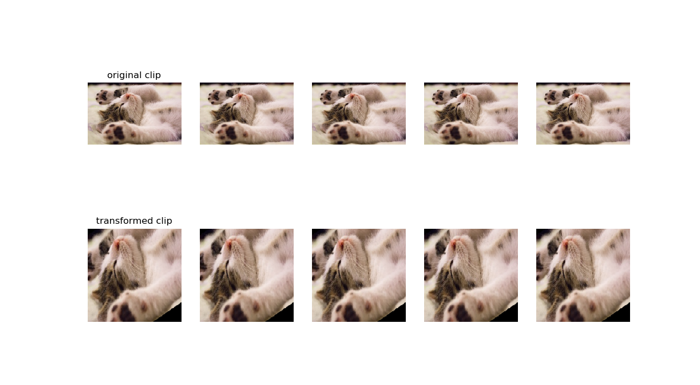

torch_videovision - Basic Video transforms for Pytorch
======================================================


This repository implements several basic data-augmentation transforms for pytorch video inputs 



The idea was to produce the equivalent of [torchvision transforms](https://github.com/pytorch/vision/tree/master/torchvision/transforms) for video inputs. (The code is therefore widely based on the code from this repository :) ) 

The basic paradigm is that dataloading should produce videoclips as a **list of PIL Images or numpy.ndarrays** (in format as read by opencv).

Several transforms are then provided in [video_transforms](torchvideotransforms/video_transforms.py).

Each transform iterates on all the images in the list and applies the wanted augmentation.


We then have to convert those inputs to torch tensors.
This can be produced by the [volume_transform](torchvideotransforms/volume_transforms.py).**ClipToTensor** class, which produces a video volume in format (n_channels, n_images, height, width) where n_channels = 3 in case of images.

When randomness is involved, the same random parameters (crop size, scale size, rotation angle,...) are applied to all the frames.

Transforms can be composed just as in torchvision with **video_transforms.Compose**.

To quickly see a demo of the transformations, run `python testtransforms.py` 

This should produce something like the top image (this is a dummy clip for now, so the same image is repeated several times)

# Advancement

[video_transforms.py](torchvideotransforms/video_transforms.py)
- [x] Compose
- [x] Resize
- [x] CenterCrop
- [x] RandomCrop
- [x] RandomHorizontalFlip
- [x] RandomResize
- [x] RandomRotation
- [x] ColorJitter (acts on brightness, saturation, contrast and hue, only on PIL Images for now)
- [ ] RandomResizedCrop

[volume_transforms.py](torchvideotransforms/volume_transforms.py)
- [x] ClipToTensor


- [ ] Add profiling utilites

# How to use

## Install torch_videovision

```shell
pip install git+https://github.com/hassony2/torch_videovision
```

Thanks to [bachsh](https://github.com/bachsh) !

## In your python script
```python
from torchvideotransforms import video_transforms, volume_transforms

video_transform_list = [video_transforms.RandomRotation(30),
			video_transforms.RandomCrop((200, 200))
			volume_transforms.ClipToTensor()]
transforms = video_transforms.Compose(video_transform_list)
```

